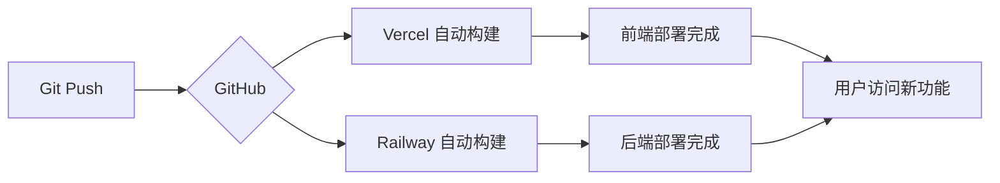

# 🚀 Nano Banana 功能部署摘要

**部署时间**: 2025-10-22
**版本**: v1.1.0
**提交**: dae21060, 6378f243

---

## ✅ 已完成的工作

### 1. 代码更新
✅ **后端更新** (12 个文件修改)
- 新增 `backend/routers/nano_banana_router.py` - Nano Banana API 路由
- 更新 `backend/models.py` - 添加 google_api_key 字段
- 更新 `backend/database_sqlite.py` - SQLite 支持
- 更新 `backend/database_supabase.py` - Supabase 支持
- 更新 `backend/main.py` - 注册新路由

✅ **前端更新**
- 新增 `frontend/src/pages/ImageGeneratorPage.jsx` - 独立图像生成器
- 更新 `frontend/src/components/chat/ChatPage.jsx` - 聊天界面集成
- 更新 `frontend/src/components/SettingsPage.jsx` - API 密钥配置
- 更新 `frontend/src/App.jsx` - 路由配置

✅ **文档更新**
- `docs/NANO_BANANA_INTEGRATION.md` - API 集成文档
- `docs/CHAT_IMAGE_GENERATION_GUIDE.md` - 使用指南
- `docs/DEPLOYMENT_VERIFICATION.md` - 部署验证指南
- `database/migrations/add_google_api_key.sql` - 数据库迁移脚本

### 2. Git 提交
✅ 已提交到 GitHub
- 提交 1: `dae21060` - 集成Nano Banana图像生成功能到聊天界面
- 提交 2: `6378f243` - 添加Supabase迁移脚本和部署验证指南

✅ 已推送到远程仓库
- 仓库: https://github.com/monicalyu924/my-AI-Notebook
- 分支: main

---

## 🔄 需要手动执行的步骤

### 步骤 1: 更新 Supabase 数据库 Schema

**重要性**: ⭐⭐⭐⭐⭐ (必须执行)

1. 登录 Supabase Dashboard: https://app.supabase.com
2. 选择您的项目
3. 进入 **SQL Editor**
4. 创建新查询并执行以下 SQL:

```sql
-- Add google_api_key column to users table
ALTER TABLE users
ADD COLUMN IF NOT EXISTS google_api_key TEXT;

-- Add comment
COMMENT ON COLUMN users.google_api_key IS 'Google API key for Nano Banana image generation';
```

5. 点击 **Run** 执行

**验证**:
```sql
SELECT column_name, data_type
FROM information_schema.columns
WHERE table_name = 'users';
```

应该看到 `google_api_key | text` 在列表中。

---

### 步骤 2: 验证 Railway 后端部署

**自动触发**: ✅ Railway 会自动检测 GitHub 推送并重新部署

**验证步骤**:

1. 登录 Railway: https://railway.app
2. 查看部署状态 (应该是 "Running")
3. 检查日志中是否包含:
   ```
   🚀 使用 Supabase 数据库: [YOUR_URL]
   INFO: Uvicorn running on http://0.0.0.0:8000
   ```

4. 测试 API 端点:
   ```bash
   curl https://[your-railway-url]/api/nano-banana/models
   ```

**预期响应**:
```json
{
  "models": [
    {
      "id": "gemini-2.5-flash-image-preview",
      "name": "Nano Banana (Gemini 2.5 Flash Image Preview)",
      ...
    }
  ]
}
```

**如果部署失败**:
- 检查 Railway 日志
- 确认环境变量配置正确 (`DATABASE_TYPE=supabase`)
- 手动触发重新部署

---

### 步骤 3: 验证 Vercel 前端部署

**自动触发**: ✅ Vercel 会自动检测 GitHub 推送并重新部署

**验证步骤**:

1. 登录 Vercel: https://vercel.com/dashboard
2. 找到 `ai-notebook-production` 项目
3. 查看最新部署状态 (应该是 "Ready")

4. 访问前端应用测试:
   - 主页: https://ai-notebook-production.vercel.app
   - 登录后访问聊天页面
   - 检查模型列表中是否有 **🍌 Nano Banana (图像生成)**

**如果未看到新功能**:
- 清除浏览器缓存 (Ctrl+Shift+R 或 Cmd+Shift+R)
- 检查 Vercel 构建日志
- 确认 `VITE_API_BASE_URL` 环境变量正确

---

## 📋 部署后测试清单

### 基础功能测试

- [ ] **健康检查**
  ```bash
  curl https://[railway-url]/health
  # 预期: {"status":"healthy"}
  ```

- [ ] **Nano Banana API 可用性**
  ```bash
  curl https://[railway-url]/api/nano-banana/models
  # 预期: 返回模型列表
  ```

- [ ] **前端页面加载**
  - 访问 https://ai-notebook-production.vercel.app
  - 应该正常显示欢迎页面

### 完整功能测试

#### 测试 1: 配置 Google API 密钥

1. [ ] 登录系统
2. [ ] 进入设置页面
3. [ ] 找到 "Google API Key" 输入框
4. [ ] 输入测试密钥并保存
5. [ ] 刷新页面，密钥应该保存成功

#### 测试 2: 聊天界面图像生成

1. [ ] 进入"AI 对话"页面
2. [ ] 点击右上角模型选择器
3. [ ] 应该看到 **🍌 Nano Banana (图像生成)** 选项
4. [ ] 选择该模型
5. [ ] 输入提示词: `一只可爱的猫咪坐在月球上，星空背景`
6. [ ] 点击发送
7. [ ] 等待 5-30 秒
8. [ ] 应该显示生成的图像
9. [ ] 点击"下载图像"应该可以保存

#### 测试 3: 独立图像生成器

1. [ ] 访问 `/image-generator` 页面
2. [ ] 输入图像描述
3. [ ] 选择生成数量 (1-4)
4. [ ] 点击"生成图像"
5. [ ] 应该在右侧显示生成的图像
6. [ ] 测试图像编辑功能

---

## 🔧 环境变量检查

### Railway 后端环境变量

确保以下变量已配置:

```bash
DATABASE_TYPE=supabase
SUPABASE_URL=https://[your-project].supabase.co
SUPABASE_SERVICE_ROLE_KEY=eyJhbGciOiJIUzI1NiIsInR5cCI6IkpXVCJ9...
SECRET_KEY=your-secret-key-here
PORT=8000
```

### Vercel 前端环境变量

确保以下变量已配置:

```bash
VITE_API_BASE_URL=https://[your-railway-url]
```

**配置位置**: Vercel Dashboard → Settings → Environment Variables

---

## 🐛 常见问题

### Q1: 聊天界面看不到 Nano Banana 模型

**原因**: 前端代码未更新或缓存问题

**解决**:
1. 检查 Vercel 部署状态
2. 清除浏览器缓存 (Ctrl+Shift+R)
3. 检查浏览器控制台是否有 JavaScript 错误

### Q2: 点击生成图像后显示"未配置 Google API 密钥"

**原因**: Supabase 数据库未添加 `google_api_key` 字段

**解决**:
1. 执行 Supabase 迁移 SQL (见上方步骤 1)
2. 在设置页面重新保存 Google API 密钥

### Q3: 图像生成时显示 404 错误

**原因**: Railway 后端未更新或路由未注册

**解决**:
1. 检查 Railway 部署日志
2. 确认 `backend/main.py` 中包含:
   ```python
   from routers import ..., nano_banana_router
   app.include_router(nano_banana_router.router)
   ```
3. 手动触发 Railway 重新部署

### Q4: CORS 错误

**原因**: 后端 CORS 配置未包含 Vercel 域名

**解决**:
1. 检查 `backend/main.py` 中的 CORS 配置
2. 确认包含:
   ```python
   allow_origins=[
       "https://ai-notebook-production.vercel.app",
       ...
   ]
   ```
3. 重新部署 Railway

---

## 📊 部署状态监控

### Railway 监控

访问: https://railway.app → 选择项目 → Metrics

关注指标:
- **CPU 使用率**: 应 < 50%
- **内存使用**: 应 < 512MB
- **请求延迟**: 图像生成 5-30s，其他 < 500ms
- **错误率**: 应 < 1%

### Vercel 监控

访问: https://vercel.com/dashboard → 选择项目 → Analytics

关注指标:
- **构建时间**: 应 < 5 分钟
- **页面加载时间**: 应 < 2 秒
- **错误率**: 应 < 1%

---

## 🔄 自动部署工作流



**时间线**:
- Git Push → 立即
- Vercel 构建 → 1-3 分钟
- Railway 构建 → 2-5 分钟
- 总部署时间 → 约 5-10 分钟

---

## 📞 支持和文档

### 详细文档

- [API 集成文档](docs/NANO_BANANA_INTEGRATION.md)
- [聊天界面使用指南](docs/CHAT_IMAGE_GENERATION_GUIDE.md)
- [部署验证指南](docs/DEPLOYMENT_VERIFICATION.md)

### 快速链接

- GitHub 仓库: https://github.com/monicalyu924/my-AI-Notebook
- Vercel 前端: https://ai-notebook-production.vercel.app
- Railway 后端: [您的 Railway URL]
- Supabase 数据库: https://app.supabase.com

### 问题反馈

如遇到问题，请在 GitHub Issues 中报告:
https://github.com/monicalyu924/my-AI-Notebook/issues

---

## ✨ 功能亮点总结

### 🍌 Nano Banana 集成
- **聊天界面**: 直接在对话中生成图像
- **独立页面**: 专业的图像创作工具
- **批量生成**: 一次最多 4 张图像
- **图像编辑**: 保持主体一致性的智能编辑

### 🎨 用户体验
- **动态提示**: 根据模型类型调整输入提示
- **智能空状态**: 提供提示词示例
- **一键下载**: 轻松保存生成的图像
- **对话历史**: 图像和文本共存

### 🔐 安全性
- **加密存储**: API 密钥安全存储在 Supabase
- **JWT 认证**: 所有 API 请求需要认证
- **密钥隔离**: OpenRouter 和 Google API 密钥分开管理

---

**部署状态**: 🟢 代码已推送，等待自动部署完成
**下一步**: 执行 Supabase 数据库迁移 SQL
**预计完成**: 10-15 分钟后所有功能可用

---

🎉 祝贺！Nano Banana 图像生成功能已成功集成到您的 AI 记事本应用中！
