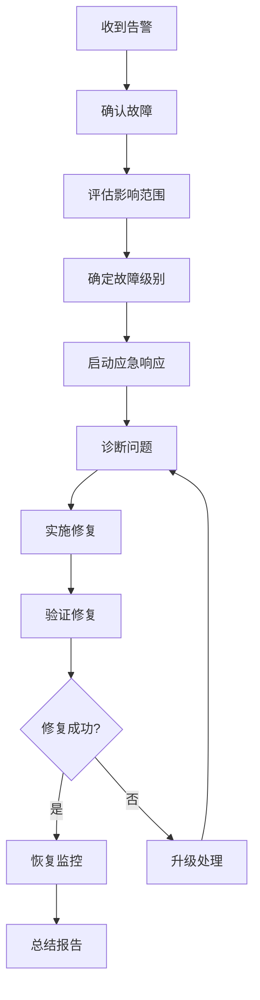

# AI智能记事本运维指南

## 概述

本文档为AI智能记事本运维团队提供日常运维、监控、故障处理和维护的详细指南。

## 目录

- [日常运维](#日常运维)
- [监控和告警](#监控和告警)
- [故障处理](#故障处理)
- [性能优化](#性能优化)
- [安全管理](#安全管理)
- [备份和恢复](#备份和恢复)
- [容量规划](#容量规划)
- [应急预案](#应急预案)

## 日常运维

### 每日检查清单

#### 系统健康状态检查

```bash
#!/bin/bash
# 每日健康检查脚本

echo "=== AI智能记事本每日健康检查 ==="
echo "检查时间: $(date)"

# 1. 检查服务状态
echo "1. 检查服务状态..."
docker-compose ps

# 2. 检查系统资源
echo "2. 检查系统资源..."
echo "CPU使用率:"
top -bn1 | grep "Cpu(s)" | awk '{print $2}' | awk -F'%' '{print $1}'

echo "内存使用率:"
free | grep Mem | awk '{printf("%.2f%%\n", $3/$2 * 100.0)}'

echo "磁盘使用率:"
df -h | grep -vE '^Filesystem|tmpfs|cdrom'

# 3. 检查网络连通性
echo "3. 检查网络连通性..."
curl -s -o /dev/null -w "%{http_code}" https://ai-notebook.com/health

# 4. 检查数据库连接
echo "4. 检查数据库连接..."
docker-compose exec -T postgres pg_isready

# 5. 检查Redis连接
echo "5. 检查Redis连接..."
docker-compose exec -T redis redis-cli ping

# 6. 检查日志错误
echo "6. 检查最近错误日志..."
grep -i error logs/backend/*.log | tail -5
grep -i error logs/nginx/*.log | tail -5

echo "=== 健康检查完成 ==="
```

#### 服务监控

```bash
# 检查所有容器状态
docker-compose ps

# 查看资源使用情况
docker stats --no-stream

# 检查容器日志
docker-compose logs --tail=50 backend
docker-compose logs --tail=50 frontend
docker-compose logs --tail=50 postgres
```

#### 日志检查

```bash
# 检查错误日志
grep -i "error\|exception\|fail" logs/backend/app.log | tail -20

# 检查访问日志异常
awk '$9 >= 400' logs/nginx/access.log | tail -20

# 检查慢查询
grep "slow query" logs/postgres/postgresql.log
```

### 每周维护任务

#### 数据库维护

```sql
-- 连接到数据库
docker-compose exec postgres psql -U postgres -d ai_notebook

-- 1. 检查数据库大小
SELECT 
    schemaname,
    tablename,
    pg_size_pretty(pg_total_relation_size(schemaname||'.'||tablename)) as size
FROM pg_tables 
WHERE schemaname = 'public'
ORDER BY pg_total_relation_size(schemaname||'.'||tablename) DESC;

-- 2. 分析查询性能
SELECT 
    query,
    calls,
    total_time,
    mean_time,
    rows
FROM pg_stat_statements 
ORDER BY total_time DESC 
LIMIT 10;

-- 3. 检查索引使用情况
SELECT 
    indexrelname,
    idx_tup_read,
    idx_tup_fetch,
    idx_tup_read/idx_tup_fetch as ratio
FROM pg_stat_user_indexes 
WHERE idx_tup_fetch > 0
ORDER BY ratio DESC;

-- 4. 运行VACUUM和ANALYZE
VACUUM ANALYZE;
```

#### 清理任务

```bash
# 清理Docker资源
docker system prune -f
docker volume prune -f

# 清理旧日志
find logs/ -name "*.log" -mtime +30 -delete

# 清理临时文件
find /tmp -name "*ai-notebook*" -mtime +7 -delete

# 清理备份文件（保留30天）
find backups/ -name "*.tar.gz" -mtime +30 -delete
```

### 每月维护任务

#### 安全更新

```bash
# 系统更新
sudo apt update && sudo apt upgrade -y

# 检查容器镜像更新
docker-compose pull

# 重建服务（如有更新）
docker-compose up -d --force-recreate
```

#### 容量分析

```bash
# 数据库容量分析
docker-compose exec postgres psql -U postgres -d ai_notebook -c "
SELECT 
    schemaname,
    tablename,
    n_tup_ins as inserts,
    n_tup_upd as updates,
    n_tup_del as deletes,
    pg_size_pretty(pg_total_relation_size(schemaname||'.'||tablename)) as size
FROM pg_stat_user_tables
JOIN pg_tables ON pg_tables.tablename = pg_stat_user_tables.relname
ORDER BY pg_total_relation_size(schemaname||'.'||tablename) DESC;
"

# 文件存储分析
du -sh uploads/*
du -sh logs/*
```

## 监控和告警

### Grafana仪表板

#### 主要监控面板

1. **系统概览**
   - 服务状态
   - 响应时间
   - 错误率
   - 用户活跃度

2. **系统资源**
   - CPU使用率
   - 内存使用率
   - 磁盘IO
   - 网络流量

3. **应用性能**
   - API响应时间
   - 数据库查询时间
   - 缓存命中率
   - 队列长度

4. **业务指标**
   - 注册用户数
   - 活跃用户数
   - 笔记创建数量
   - AI功能使用量

#### 告警规则配置

```yaml
# Prometheus告警规则
groups:
  - name: ai-notebook-alerts
    rules:
      # 服务可用性告警
      - alert: ServiceDown
        expr: up == 0
        for: 1m
        labels:
          severity: critical
        annotations:
          summary: "服务 {{ $labels.instance }} 宕机"
          description: "服务已宕机超过1分钟"

      # 高错误率告警
      - alert: HighErrorRate
        expr: rate(http_requests_total{status=~"5.."}[5m]) > 0.1
        for: 5m
        labels:
          severity: warning
        annotations:
          summary: "高错误率检测"
          description: "5xx错误率超过10%"

      # 响应时间告警
      - alert: HighResponseTime
        expr: histogram_quantile(0.95, rate(http_request_duration_seconds_bucket[5m])) > 2
        for: 5m
        labels:
          severity: warning
        annotations:
          summary: "响应时间过长"
          description: "95%的请求响应时间超过2秒"
```

### 告警通知渠道

#### 邮件告警

```yaml
# AlertManager邮件配置
receivers:
  - name: 'ops-team'
    email_configs:
      - to: 'ops@ai-notebook.com'
        subject: '[AI记事本] {{ .GroupLabels.alertname }}'
        body: |
          告警详情:
          - 告警名称: {{ .GroupLabels.alertname }}
          - 严重程度: {{ .CommonLabels.severity }}
          - 影响实例: {{ .CommonLabels.instance }}
          - 开始时间: {{ .CommonAnnotations.startsAt }}
```

#### Slack集成

```bash
# Slack Webhook配置
curl -X POST -H 'Content-type: application/json' \
--data '{"text":"AI记事本告警: 服务响应异常"}' \
$SLACK_WEBHOOK_URL
```

## 故障处理

### 故障分级

#### P0 - 紧急故障
- 整个系统不可用
- 数据丢失风险
- 安全漏洞

**响应时间**: 15分钟内
**解决时间**: 2小时内

#### P1 - 高优先级故障
- 核心功能不可用
- 性能严重下降
- 部分用户受影响

**响应时间**: 30分钟内
**解决时间**: 4小时内

#### P2 - 中优先级故障
- 非核心功能问题
- 性能轻微下降
- 少数用户受影响

**响应时间**: 2小时内
**解决时间**: 24小时内

### 常见故障处理

#### 数据库连接失败

```bash
# 1. 检查数据库状态
docker-compose ps postgres

# 2. 检查数据库日志
docker-compose logs postgres

# 3. 检查连接数
docker-compose exec postgres psql -U postgres -c "
SELECT count(*) as active_connections 
FROM pg_stat_activity 
WHERE state = 'active';
"

# 4. 重启数据库（谨慎操作）
docker-compose restart postgres

# 5. 检查数据完整性
docker-compose exec postgres pg_dump -U postgres ai_notebook > /tmp/db_check.sql
```

#### 内存不足

```bash
# 1. 查看内存使用
free -h
docker stats

# 2. 清理Docker缓存
docker system prune -f

# 3. 重启内存使用高的容器
docker-compose restart backend

# 4. 调整容器内存限制
# 在docker-compose.yml中添加:
# deploy:
#   resources:
#     limits:
#       memory: 512M
```

#### SSL证书过期

```bash
# 1. 检查证书到期时间
openssl x509 -in ssl/cert.pem -noout -dates

# 2. 续期Let's Encrypt证书
sudo certbot renew

# 3. 重启Nginx
docker-compose restart nginx

# 4. 验证证书
curl -vI https://ai-notebook.com 2>&1 | grep -A 5 "certificate"
```

#### 磁盘空间不足

```bash
# 1. 检查磁盘使用
df -h

# 2. 查找大文件
find / -type f -size +100M -exec ls -lh {} \; 2>/dev/null

# 3. 清理日志文件
find logs/ -name "*.log" -mtime +7 -delete

# 4. 清理Docker数据
docker system prune -a

# 5. 移动数据到其他分区（如需要）
mv logs /opt/larger-disk/logs
ln -s /opt/larger-disk/logs logs
```

### 故障处理流程



## 性能优化

### 应用层优化

#### 数据库查询优化

```sql
-- 1. 创建合适的索引
CREATE INDEX CONCURRENTLY idx_notes_user_created 
ON notes(user_id, created_at DESC);

CREATE INDEX CONCURRENTLY idx_notes_fulltext 
ON notes USING gin(to_tsvector('english', title || ' ' || content));

-- 2. 分析慢查询
SELECT query, mean_time, calls, total_time
FROM pg_stat_statements 
WHERE mean_time > 100  -- 超过100ms的查询
ORDER BY mean_time DESC;

-- 3. 优化查询计划
EXPLAIN (ANALYZE, BUFFERS) 
SELECT * FROM notes 
WHERE user_id = 1 
ORDER BY created_at DESC 
LIMIT 10;
```

#### 缓存策略优化

```python
# Redis缓存配置优化
redis_config = {
    'maxmemory': '256mb',
    'maxmemory-policy': 'allkeys-lru',
    'timeout': 300,
    'tcp-keepalive': 60,
}

# 应用级缓存
@lru_cache(maxsize=1000)
def get_user_permissions(user_id):
    # 缓存用户权限
    pass

# 页面级缓存
@cache_page(60 * 15)  # 缓存15分钟
def get_notes_list(request):
    # 缓存笔记列表
    pass
```

### 系统层优化

#### Nginx配置优化

```nginx
# 工作进程数
worker_processes auto;
worker_connections 1024;

# 开启gzip压缩
gzip on;
gzip_vary on;
gzip_min_length 1024;
gzip_comp_level 6;
gzip_types
    text/plain
    text/css
    text/xml
    text/javascript
    application/json
    application/javascript
    application/xml+rss
    application/atom+xml
    image/svg+xml;

# 静态文件缓存
location ~* \.(jpg|jpeg|png|gif|ico|css|js)$ {
    expires 1y;
    add_header Cache-Control "public, immutable";
    access_log off;
}

# 启用HTTP/2
listen 443 ssl http2;

# 连接保持
keepalive_timeout 65;
keepalive_requests 100;
```

#### 数据库配置优化

```postgresql
# postgresql.conf优化配置

# 内存设置
shared_buffers = 256MB
effective_cache_size = 1GB
work_mem = 4MB
maintenance_work_mem = 64MB

# 连接设置
max_connections = 100
shared_preload_libraries = 'pg_stat_statements'

# 日志设置
log_min_duration_statement = 1000  # 记录超过1秒的查询
log_checkpoints = on
log_lock_waits = on

# 性能设置
checkpoint_completion_target = 0.9
wal_buffers = 16MB
random_page_cost = 1.1  # SSD存储
```

### 容量规划

#### 用户增长预测

```python
# 容量规划计算脚本
import math

def calculate_capacity_requirements(users, growth_rate, period_months):
    """
    计算容量需求
    
    Args:
        users: 当前用户数
        growth_rate: 月增长率 (例如: 0.1 表示10%)
        period_months: 预测周期（月）
    """
    
    # 用户增长预测
    future_users = users * (1 + growth_rate) ** period_months
    
    # 存储需求预测（每用户平均100MB）
    storage_per_user = 100  # MB
    total_storage_gb = (future_users * storage_per_user) / 1024
    
    # 数据库连接需求
    concurrent_ratio = 0.1  # 10%的用户同时在线
    max_connections = math.ceil(future_users * concurrent_ratio)
    
    # 带宽需求预测（每用户平均1MB/月）
    bandwidth_per_user = 1  # MB/月
    monthly_bandwidth_gb = (future_users * bandwidth_per_user) / 1024
    
    return {
        'future_users': int(future_users),
        'storage_gb': int(total_storage_gb),
        'max_connections': max_connections,
        'monthly_bandwidth_gb': int(monthly_bandwidth_gb)
    }

# 示例：预测6个月后的容量需求
current_users = 1000
monthly_growth = 0.15  # 15%月增长
prediction = calculate_capacity_requirements(current_users, monthly_growth, 6)
print(f"6个月后预期用户数: {prediction['future_users']}")
print(f"存储需求: {prediction['storage_gb']} GB")
print(f"数据库连接数: {prediction['max_connections']}")
print(f"月带宽需求: {prediction['monthly_bandwidth_gb']} GB")
```

## 安全管理

### 访问控制

#### SSH安全配置

```bash
# /etc/ssh/sshd_config 安全配置
Port 2222  # 更改默认端口
PermitRootLogin no
PasswordAuthentication no
PubkeyAuthentication yes
MaxAuthTries 3
ClientAliveInterval 300
ClientAliveCountMax 2

# 重启SSH服务
sudo systemctl restart sshd
```

#### 防火墙配置

```bash
# UFW防火墙规则
sudo ufw default deny incoming
sudo ufw default allow outgoing
sudo ufw allow 2222/tcp  # SSH
sudo ufw allow 80/tcp    # HTTP
sudo ufw allow 443/tcp   # HTTPS
sudo ufw enable

# 查看规则
sudo ufw status numbered
```

#### Fail2ban配置

```ini
# /etc/fail2ban/jail.local
[DEFAULT]
bantime = 3600
findtime = 600
maxretry = 3

[sshd]
enabled = true
port = 2222
logpath = /var/log/auth.log

[nginx-http-auth]
enabled = true
filter = nginx-http-auth
logpath = /opt/ai-notebook/logs/nginx/error.log
maxretry = 5
```

### 安全审计

#### 定期安全检查

```bash
#!/bin/bash
# 安全审计脚本

echo "=== 安全审计报告 ==="
echo "检查时间: $(date)"

# 1. 检查用户登录
echo "1. 最近登录记录:"
last -n 10

# 2. 检查失败登录
echo "2. 失败登录尝试:"
grep "Failed password" /var/log/auth.log | tail -5

# 3. 检查系统更新
echo "3. 系统更新状态:"
apt list --upgradable 2>/dev/null | head -10

# 4. 检查开放端口
echo "4. 开放端口:"
ss -tuln

# 5. 检查进程
echo "5. 可疑进程:"
ps aux | grep -E "(bash|sh)" | grep -v grep

# 6. 检查文件权限
echo "6. 敏感文件权限:"
ls -la /opt/ai-notebook/.env
ls -la /opt/ai-notebook/ssl/

echo "=== 审计完成 ==="
```

#### 漏洞扫描

```bash
# 使用Lynis进行系统安全扫描
wget https://downloads.cisofy.com/lynis/lynis-3.0.8.tar.gz
tar xzf lynis-3.0.8.tar.gz
cd lynis
sudo ./lynis audit system

# 使用Trivy扫描容器漏洞
docker run --rm -v /var/run/docker.sock:/var/run/docker.sock \
  aquasec/trivy image ai-notebook-backend:latest
```

## 备份和恢复

### 自动备份策略

#### 全量备份脚本

```bash
#!/bin/bash
# 全量备份脚本

BACKUP_DIR="/opt/backups/ai-notebook"
DATE=$(date +%Y%m%d_%H%M%S)
RETENTION_DAYS=30

# 创建备份目录
mkdir -p $BACKUP_DIR

# 1. 备份数据库
echo "备份数据库..."
docker-compose exec -T postgres pg_dump -U postgres -Fc ai_notebook > \
  $BACKUP_DIR/database_$DATE.dump

# 2. 备份文件数据
echo "备份文件数据..."
tar -czf $BACKUP_DIR/files_$DATE.tar.gz \
  uploads/ \
  ssl/ \
  .env \
  docker-compose.yml

# 3. 备份配置文件
echo "备份配置文件..."
tar -czf $BACKUP_DIR/config_$DATE.tar.gz \
  nginx/ \
  monitoring/ \
  scripts/

# 4. 上传到云存储（可选）
if [ ! -z "$AWS_S3_BUCKET" ]; then
  aws s3 sync $BACKUP_DIR s3://$AWS_S3_BUCKET/backups/
fi

# 5. 清理旧备份
find $BACKUP_DIR -name "*.dump" -mtime +$RETENTION_DAYS -delete
find $BACKUP_DIR -name "*.tar.gz" -mtime +$RETENTION_DAYS -delete

echo "备份完成: $BACKUP_DIR"
```

#### 增量备份

```bash
#!/bin/bash
# 增量备份脚本

BACKUP_DIR="/opt/backups/incremental"
DATE=$(date +%Y%m%d_%H%M%S)
LAST_BACKUP_FILE="$BACKUP_DIR/.last_backup"

# 创建备份目录
mkdir -p $BACKUP_DIR

# 获取上次备份时间
if [ -f $LAST_BACKUP_FILE ]; then
  LAST_BACKUP=$(cat $LAST_BACKUP_FILE)
else
  LAST_BACKUP="1970-01-01"
fi

# 增量备份文件
find uploads/ -newer $LAST_BACKUP_FILE -type f | \
  tar -czf $BACKUP_DIR/incremental_$DATE.tar.gz -T -

# 更新备份时间戳
date > $LAST_BACKUP_FILE

echo "增量备份完成"
```

### 恢复流程

#### 数据库恢复

```bash
# 1. 停止应用服务
docker-compose stop backend frontend

# 2. 备份当前数据库
docker-compose exec -T postgres pg_dump -U postgres ai_notebook > \
  /tmp/current_backup.sql

# 3. 删除现有数据库
docker-compose exec postgres psql -U postgres -c "DROP DATABASE ai_notebook;"

# 4. 创建新数据库
docker-compose exec postgres psql -U postgres -c "CREATE DATABASE ai_notebook;"

# 5. 恢复数据
docker-compose exec -T postgres pg_restore -U postgres -d ai_notebook \
  < backup_file.dump

# 6. 重启服务
docker-compose start backend frontend

# 7. 验证恢复
curl -f https://ai-notebook.com/health
```

#### 文件恢复

```bash
# 1. 备份当前文件
mv uploads uploads_backup_$(date +%Y%m%d)

# 2. 恢复文件
tar -xzf files_backup.tar.gz

# 3. 设置权限
chown -R 1000:1000 uploads/
chmod -R 755 uploads/
```

## 应急预案

### 灾难恢复计划

#### RTO/RPO目标

- **RTO** (Recovery Time Objective): 4小时
- **RPO** (Recovery Point Objective): 1小时

#### 灾难场景和响应

##### 场景1：数据中心故障

**影响**: 整个系统不可用
**响应时间**: 2小时内
**恢复步骤**:

1. 激活备用数据中心
2. 从最新备份恢复数据
3. 更新DNS指向新环境
4. 验证系统功能
5. 通知用户服务恢复

##### 场景2：数据库损坏

**影响**: 数据读写异常
**响应时间**: 1小时内
**恢复步骤**:

1. 立即切换到只读模式
2. 评估数据损坏程度
3. 从最新备份恢复
4. 验证数据完整性
5. 恢复写入功能

##### 场景3：安全攻击

**影响**: 数据泄露风险
**响应时间**: 30分钟内
**恢复步骤**:

1. 立即隔离受影响系统
2. 分析攻击途径和影响范围
3. 修复安全漏洞
4. 从干净备份恢复系统
5. 加强安全监控

### 应急联系清单

#### 内部团队

- **运维团队**: ops@ai-notebook.com
- **开发团队**: dev@ai-notebook.com  
- **安全团队**: security@ai-notebook.com
- **管理层**: management@ai-notebook.com

#### 外部供应商

- **云服务商**: support@cloud-provider.com
- **域名服务商**: support@domain-provider.com
- **SSL证书商**: support@ssl-provider.com
- **CDN供应商**: support@cdn-provider.com

### 通信模板

#### 故障通知模板

```
主题: [紧急] AI智能记事本服务故障通知

尊敬的用户，

我们检测到AI智能记事本服务出现故障：

故障时间: 2024-01-01 14:30 UTC
故障影响: 用户无法正常访问系统
预计恢复时间: 2024-01-01 16:30 UTC

我们正在紧急处理这个问题，将及时更新进展。

感谢您的耐心等待。

AI智能记事本团队
```

#### 恢复通知模板

```
主题: [已解决] AI智能记事本服务已恢复正常

尊敬的用户，

AI智能记事本服务已于 2024-01-01 16:15 UTC 恢复正常。

故障原因: 数据库连接池配置问题
解决方案: 优化了连接池配置并重启了相关服务
预防措施: 加强了监控告警机制

如您在使用过程中遇到任何问题，请联系技术支持。

AI智能记事本团队
```

## 运维工具和脚本

### 自动化脚本

#### 服务重启脚本

```bash
#!/bin/bash
# 安全重启服务脚本

SERVICE_NAME=${1:-"all"}
BACKUP_BEFORE_RESTART=${2:-"yes"}

echo "准备重启服务: $SERVICE_NAME"

# 创建备份
if [ "$BACKUP_BEFORE_RESTART" = "yes" ]; then
  echo "创建备份..."
  ./scripts/backup.sh
fi

# 检查服务状态
echo "当前服务状态:"
docker-compose ps

# 重启服务
case $SERVICE_NAME in
  "all")
    docker-compose restart
    ;;
  "backend"|"frontend"|"postgres"|"redis"|"nginx")
    docker-compose restart $SERVICE_NAME
    ;;
  *)
    echo "未知服务: $SERVICE_NAME"
    exit 1
    ;;
esac

# 等待服务启动
sleep 30

# 验证服务
echo "验证服务状态:"
docker-compose ps
curl -f https://ai-notebook.com/health

echo "服务重启完成"
```

#### 数据库维护脚本

```bash
#!/bin/bash
# 数据库维护脚本

echo "开始数据库维护..."

# 1. 备份数据库
docker-compose exec -T postgres pg_dump -U postgres ai_notebook > \
  /tmp/maintenance_backup_$(date +%Y%m%d).sql

# 2. 清理过期数据
docker-compose exec postgres psql -U postgres -d ai_notebook -c "
-- 清理30天前的日志
DELETE FROM logs WHERE created_at < NOW() - INTERVAL '30 days';

-- 清理过期的用户会话
DELETE FROM user_sessions WHERE expires_at < NOW();

-- 清理临时文件记录
DELETE FROM temp_files WHERE created_at < NOW() - INTERVAL '7 days';
"

# 3. 重建索引
docker-compose exec postgres psql -U postgres -d ai_notebook -c "
REINDEX DATABASE ai_notebook;
"

# 4. 分析统计信息
docker-compose exec postgres psql -U postgres -d ai_notebook -c "
VACUUM ANALYZE;
"

# 5. 检查数据库大小
docker-compose exec postgres psql -U postgres -d ai_notebook -c "
SELECT 
  pg_size_pretty(pg_database_size('ai_notebook')) as database_size;
"

echo "数据库维护完成"
```

### 监控脚本

#### 资源监控脚本

```bash
#!/bin/bash
# 系统资源监控脚本

ALERT_THRESHOLD_CPU=80
ALERT_THRESHOLD_MEMORY=85
ALERT_THRESHOLD_DISK=90

# 检查CPU使用率
CPU_USAGE=$(top -bn1 | grep "Cpu(s)" | awk '{print $2}' | awk -F'%' '{print $1}')
if (( $(echo "$CPU_USAGE > $ALERT_THRESHOLD_CPU" | bc -l) )); then
  echo "ALERT: CPU使用率过高: $CPU_USAGE%"
fi

# 检查内存使用率
MEMORY_USAGE=$(free | grep Mem | awk '{printf("%.1f", $3/$2 * 100.0)}')
if (( $(echo "$MEMORY_USAGE > $ALERT_THRESHOLD_MEMORY" | bc -l) )); then
  echo "ALERT: 内存使用率过高: $MEMORY_USAGE%"
fi

# 检查磁盘使用率
DISK_USAGE=$(df / | tail -1 | awk '{print $5}' | sed 's/%//')
if [ $DISK_USAGE -gt $ALERT_THRESHOLD_DISK ]; then
  echo "ALERT: 磁盘使用率过高: $DISK_USAGE%"
fi

# 检查服务状态
SERVICES_DOWN=$(docker-compose ps | grep -c "Exit\|Down")
if [ $SERVICES_DOWN -gt 0 ]; then
  echo "ALERT: 发现 $SERVICES_DOWN 个服务异常"
fi
```

## 版本控制和发布

### 发布流程

```bash
#!/bin/bash
# 生产环境发布脚本

VERSION=$1
if [ -z "$VERSION" ]; then
  echo "请指定版本号: ./deploy.sh v1.0.0"
  exit 1
fi

echo "开始发布版本: $VERSION"

# 1. 创建发布前备份
./scripts/backup.sh

# 2. 拉取新代码
git fetch origin
git checkout $VERSION

# 3. 构建新镜像
docker-compose build

# 4. 运行数据库迁移
./scripts/migrate-database.sh migrate

# 5. 滚动更新服务
docker-compose up -d --no-deps backend
sleep 30
docker-compose up -d --no-deps frontend

# 6. 验证部署
sleep 60
curl -f https://ai-notebook.com/health
if [ $? -eq 0 ]; then
  echo "发布成功: $VERSION"
else
  echo "发布验证失败，开始回滚..."
  git checkout -
  docker-compose up -d --force-recreate
fi
```

---

本运维指南持续更新，最后修订时间：2024年1月1日